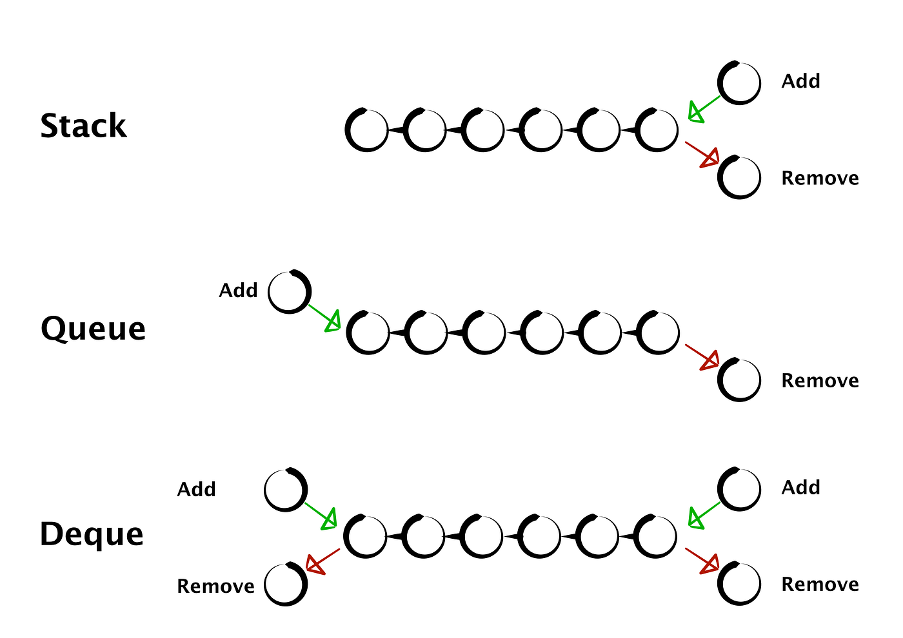
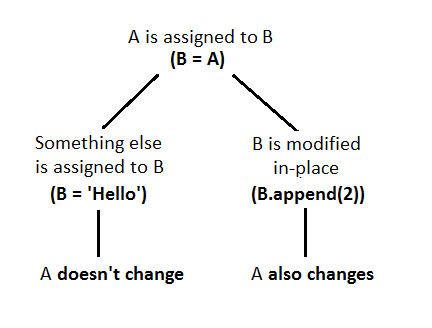

# Definition for singly-linked list.

class Solution:
    def removeNthFromEnd(self, head: Optional[ListNode], n: int) -> Optional[ListNode]:
        

        length = 0

        ll = head
        while ll:
            ll = ll.next
        print("head:",head, "\n\n" , "ll:", ll)

        """

        head: ListNode{val: 1, next: ListNode{val: 2, next: ListNode{val: 3, next:      ListNode{val: 4, next:   ListNode{val: 5, next: None}}}}} 

        ll: None
        """

Kod içerisinde ll değişse de head değişmiyor çünkü head orijinal objenin referansı ve orijinal objede değişiklik yapılmıyor. Eğer head değişirse orijinal objeyi bulabileceğimiz referans kalmayacağı için ona ulaşamayız